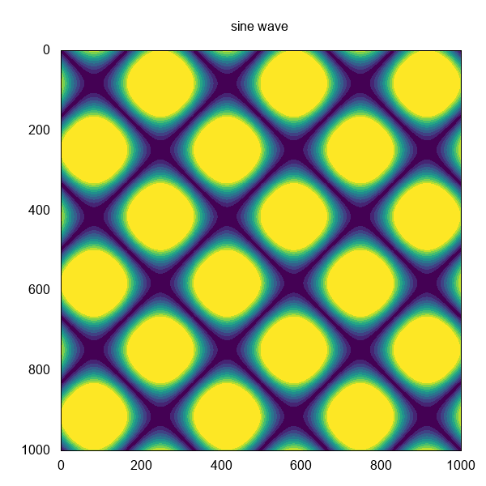

# recurrence_plot_memo

1. リカレンスプロットをはじめて知ったのは「[デジタル台風](http://agora.ex.nii.ac.jp/digital-typhoon/)」だった。
2. 興味を持って少し調べたところ、距離行列からリカレンスプロットを作図できることを知る。
3. おもしろそうなので、いろいろ試してみる。

## python


*  [recurrence_plot_p.py](./recurrence_plot_p.py)
*  [recurrence_plot_p.ipynb](./recurrence_plot_p.ipynb)

pythonで距離行列を作るには abs(差分の絶対値を計算)の他に scipy-pdist, scipy-cdist, sklearn-pairwise_distances, pyts-RecurrencePlot 等のいくつかのライブラリを見つけた。


## ruby



*  [recurrence_plot_r.rb](./recurrence_plot_r.rb)

rubyでは、Numo::NArrayを使うと距離行列を簡単に作成できる。

``` ruby
require 'numo/narray'

s = Numo::DFloat.linspace(1,5,5)
st = Numo::NArray[s].transpose
dist_m = (s - st).abs


dist_m
=>
Numo::DFloat#shape=[5,5]
[[0, 1, 2, 3, 4],
 [1, 0, 1, 2, 3],
 [2, 1, 0, 1, 2],
 [3, 2, 1, 0, 1],
 [4, 3, 2, 1, 0]]
```


